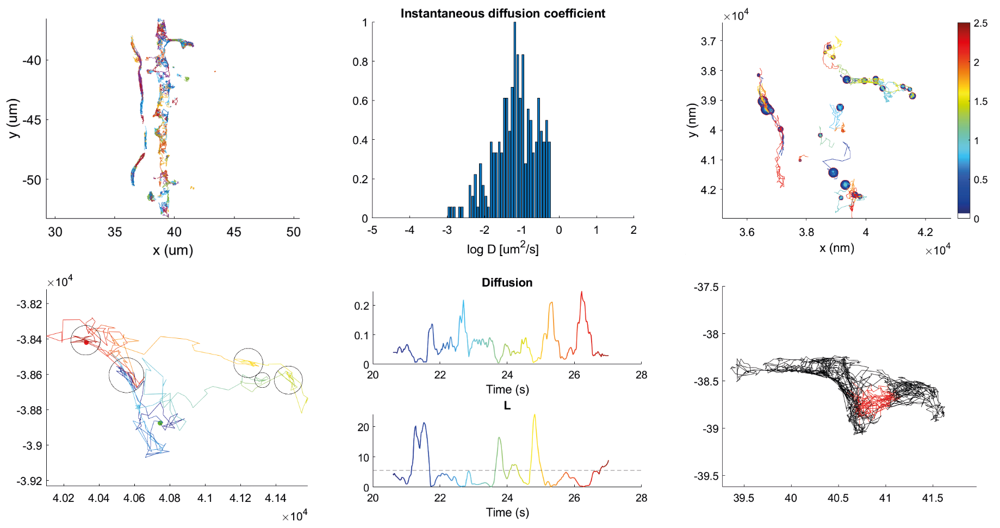

# SMT_analysis
## Single-molecule tracking analysis in Matlab
With these scripts you can perform single-molecule tracking analysis in MATLAB.
It includes:
- transient confinement analysis
- creating a PSD mask based on a widefield image
- analyzing synaptic trajectories
- creating many different plots with tracks and graphs

## Important information at the start
Almost every analysis script needs an associated parameter script, this parameter script will be ignored by git ('\*_param.m' is in the gitignore file), 
thus changes in those scripts won't be tracked (so you can freely play with the parameters). After you cloned the repository, in your local repository folder you can find the '*_param.m.sample' file (with default parameter values and this file will be tracked by git), which needs to be duplicated 
in your folder and from the duplicate you remove the '.sample' from the file extension. If you add a parameter to the parameter script that needs to be tracked by git or want to change a default value, you should adjust the corresponding param.m.sample file.    
**Example for first time using the scripts:**  
in your repository folder you see the file: 'extract_confined_param.m.sample', you duplicate this file 
(leave the original intact as it will be tracked by git) and rename the copy to 'extract_confined_param.m'.
You should do this for all the associated parameter files for the analysis scripts you will use.

### Used software
- MATLAB version 9.10 (2021a)
	- Image Processing Toolbox (tested with version 11.3)
	- Statistics and Machine Learning Toolbox (tested with version 12.1)

For the export_fig function you need a ghostscript installation on your computer. 
It can be downloaded from www.ghostscript.com
When you run the scripts the first time there will be a dialogue box where it asks you to locate Ghostscript.

## Input data
- csv file with localization table (tested with localization table from ONI), containing columns with for each localization:
    - frame number 
    - x precision in nm
    - y precision in nm
    - x in pix
    - y in pix
- interval time and pixel size from the acquisition should be entered in the parameter script
- widefield image to base the ROI on (optional)
- widefield image of a PSD marker (optional)

## Instructions for use
- Add this repository to your path in MATLAB
- Before running a script, check the corresponding parameter script and adjust the parameters according to your analysis
- Start running scripts in the correct order, more details can be found at the start of each script:
	1. convert_results2trajectory.m
		- tracking & discrimination between mobile and immobile tracks
    - For confinement analysis:  
        - extract_confined.m  
            - transient confinement analysis
            - plotting confinement zones and maps
    - For PSD related analysis:
        1. make_psd_mask.m
            - create PSD mask from widefield/near-TIRF image
            - first, running segmentation of PSDs and second, individualized PSD filtering
        2. extract_synaptic_perisynaptic_transient_tracks.m
            - extract diffusion coefficients of synaptic and extrasynaptic tracks
            - obtain information on entries and exits of the PSD
            - part with defining diffusion in and outside synapses based on Dr is only possible after running confinement script, comment out otherwise
    - Only after both extract_confined.m and make_psd_mask.m:
        - dist_confinement_to_PSD.m
            - section 1: calculate distance from confinement zone centers to border PSD
            - section 2: calculate distance from immobile track centers to border PSD
            - section 3: calculate distance from confinement zone centers to border PSD only for tracks with some PSD overlap
            - section 4: single PSD analysis

### Optional extra scripts
- plot_results.m
    - whole range of different plotting options based on output from the previous scripts
    - use per section
- draw_ROIs_on_image.m
    - Draw ROIs on a widefield image, could be used to analyze tracks in the spine vs dendrite
    - Output is similar to PSD mask script: cell with all the boundary coordinates of the ROIs in nm
- select_tracks_spines_dendrites.m
    - based on ROIs made with 'draw_ROIs_on_image.m'
    - output is the list of diffusion coefficients per group
    - last section is plotting for comparison
- plot_synaptic_tracks.m
    - options to plot synaptic/extrasynaptic tracks on top of PSD marker

## Example data set
An example data set of GFP-GPI tracking is added to the repository to test the different analysis scripts. Below you can see some plots from the expected output.

## References
- Golan, Y., and Sherman, E. (2017). Resolving mixed mechanisms of protein subdiffusion at the T cell plasma membrane. Nat. Commun. 8, 15851. doi: 10.1038/ncomms15851.
- Lu, H. E., MacGillavry, H. D., Frost, N. A., and Blanpied, T. A. (2014). Multiple Spatial and Kinetic Subpopulations of CaMKII in Spines and Dendrites as Resolved by Single-Molecule Tracking PALM. J. Neurosci. 34, 7600–7610. doi: 10.1523/JNEUROSCI.4364-13.2014.
- Meilhac, N., Le Guyader, L., Salomé, L., and Destainville, N. (2006). Detection of confinement and jumps in single-molecule membrane trajectories. Phys. Rev. E 73, 011915. doi: 10.1103/PhysRevE.73.011915.
- Menchón, S. A., Martín, M. G., and Dotti, C. G. (2012). APM_GUI: analyzing particle movement on the cell membrane and determining confinement. BMC Biophys. 5, 4. doi: 10.1186/2046-1682-5-4.
- Simson, R., Sheets, E. D., and Jacobson, K. (1995). Detection of temporary lateral confinement of membrane proteins using single-particle tracking analysis. Biophys. J. 69, 989–993. doi: 10.1016/S0006-3495(95)79972-6.
- Westra, M., and MacGillavry, H. D. (2022). Precise Detection and Visualization of Nanoscale Temporal Confinement in Single-Molecule Tracking Analysis. Membranes (Basel). 12, 650. doi: 10.3390/membranes12070650.
